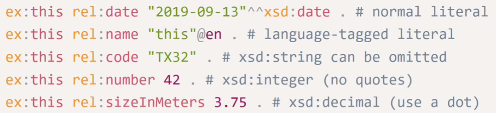
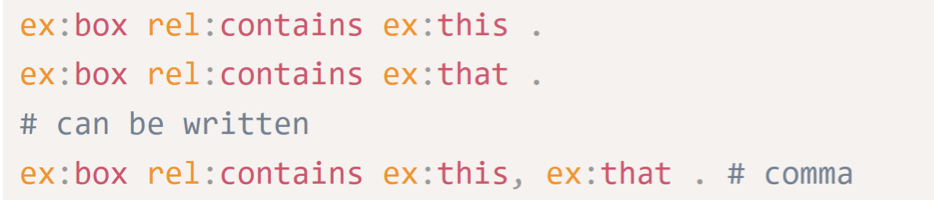
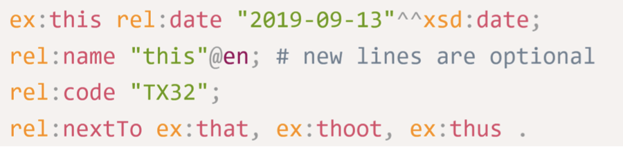

# Resource Description Framework (RDF)

Atualmente a WEB tem pesquisas frequentes mas de baixa precisão, porque o conteúdo é muito sensível ao vocabulário usado e ao contexto em que está inserido. De modo a que a WEB seja um local de informação estruturada, para que as máquinas consigam compreender, foi necessário criar uma estrutura global de recursos com a mesma sintaxe: usa-se a resource description framework, onde um `resource` pode ser qualquer coisa.

### Características

-  `W3` standard;
-  `data model` (não um file format!);
- *lingua franca* da Semantic Web;
- `graph` based model;
- faz *data integration* e relação entre documentos e outros resources;

### Triples

A unidade básica do RDF é o `triple` entre (subject, property, object). Também pode ser chamado de statements:

> <"Mozart", composed, "The Magic Flute"> <br>

- `Subject` pode ser qualquer coisa, desde que tenha um URI/IRI;
- `Property/Predicate`é uma propriedade binária identificada também por uma URI que descreve relações entre os recursos das pontas;
- `Value` é também um novo recurso;

```xml
<rdf:Description rdf:about=“#lsf”>
    <has_email>lsferreira@fe.up</has_email>
</rdf:Description>
```

Para números devemos usar o standard IRI que é o `xsd` (XML Schema Datatype).

```xml
<rdf:RDF xmlns:wc=”http://www.lapd.fe.up.pt/~exRDF/wc/schema”>
    <rdf:Description about=”http://www.cnn.com/2000/HEALTH/cancer/12/06/
    colon.cancer.ap/index.html”>
    <wc:Title>Cigarette smoking linked to colorectal cancer</wc:Title>
    </rdf:Description>
</rdf:RDF>
```

### RDF Graphs

Podemos ver os triplos como nós ligados por uma edge que lhes dá contexto e relação. Podem ser direcionados ou até multigrafos em contextos mais complexos e overlapped.

### RDF Serialization

É ver os grafos como texto e ficheiros para uma maior portabilidade. Um serializador é por exemplo o [Turtle](https://www.w3.org/TR/turtle/).

#### Turtle

"Terse RDF Triple Language" (Turtle) permite compactação de URIs (CURIEs) para prevenir partes repetidas de triples. 

Some examples:

```xml
# This is a comment
@prefix ex: <http://www.example.com/test#> . # end dot!
@prefix rel: <http://relations.example.com/> .
ex:this rel:in ex:box . # Another comment
```

Irá resultar em:

```xml
<http://www.example.com/test#this>
    <http://relations.example.com/in>
<http://www.example.com/test#box>
```

Literals:



If two triples share both the same subject and predicate, the two objects can be separated by commas:



With repeated object:



Há mais uma interessante abreviação em Turtle: `rdf:type` pode ser simplesmente `a`:

```rdf
dbr:Bob_Marley a foaf:Person
```

Existe também um editor online de Turtle: [YATE](https://perfectkb.github.io/yate/)

### Examples

```xml
<A, rdf:type, B> - A belongs to B
<P, rdf:type, rdf:Property> - P is a property
<rdf:type, rdf:type, rdf:Property> - rdf:type is a property
```

## RDF Schema - RDFS

Permite representar ontologias e vocabulários usando RDF. 