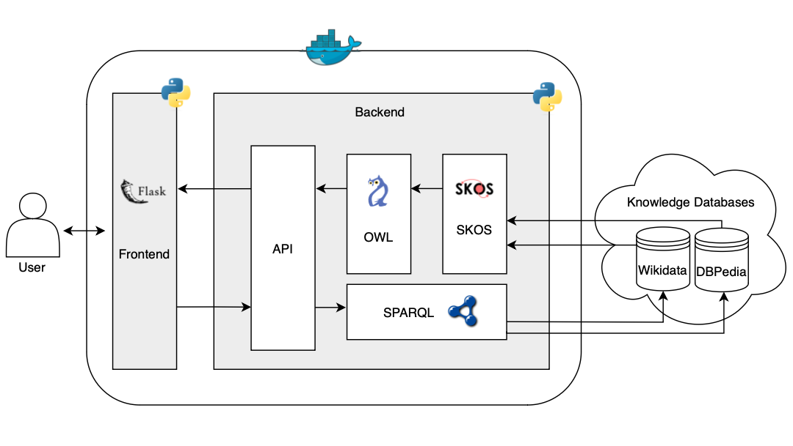

# Wordify - WSDL Project - Checkpoint 2

## Group Members

- Fábio Araújo de Sá (up202007658@up.pt)
- Marcos Rafael Peixoto Aires (up202006888@up.pt)
- Pedro Pereira Ferreira (up202004986@up.pt)

## Context

Wordify is a system that disambiguates existing entities, possibly in different languages, using Web Semantics and Linked Data principles, concepts, and technologies. It will help a computer and humans to perceive which entity is being referred to, if it is ambiguous in a certain context, or to consult false friends or regionalisms between languages.

## Motivation

Humans always tried to communicate in a clear and simple way with others, as well as with computers. However, it is a critical, inherent problem of the languages used by humans to communicate, is that there are ambiguous.

It is easy to think of a word, or something that can have different meanings, for different contexts: for instance, when someone is talking about a "balance", this word can mean the state in which opposing forces, or can also mean the object used to measure weights. So, when a person is looking on the web the meaning or a representation of the entity "balance", what content should appear?

Another problem faced with natural languages is the fact that the same word can also have divergent meanings in different languages (false friends): for instance the word "vela" in italian is the same as "sail", but means "candle" in Spanish. As a consequence, it becomes difficult to connect the same words in different languages, if we are using the words to represent entities on web.

Finally, another motivating example is the regionalisms that exist in languages, which makes words vary its meaning accross the location: for instance, a "garoto" in Porto is the same word for "kid", but in Lisbon can mean a coffee. If this word were search on Web, what content should appear in different portuguese locations?

With the exposure of this problems, it is clear that if it was a system that manipulates a knowledge base in a way that could clarify the entities search, according to the multilanguages charactheristics, contexts, and locations of where it is being used. To fulfill this purpose, Wordify will be built.

## Requirements

Globally, the system should be capable of:

- Linking various concepts to the entities being searched;
- Disambiguating concepts within and across languages;
- Consulting false friends and regionalisms of the entity, if they exist.

While adhering to the Linked Data Principles / Tim Berners-Lee’s 4 Principles:

1. Use Uniform Resource Identifiers (URIs) to identify resources;
2. Use HTTP URIs so people can look up data;
3. Provide useful information in standard formats (RDF);
4. Include links to other URIs to connect data.

## Existing solutions and approaches

### DBpedia Spotlight

DBpedia Spotlight is an entity disambiguation tool that uses the DBpedia knowledge base to identify and link entities in text. It applies natural language processing (NLP) techniques to connect terms to URIs in DBpedia.

### Wikidata Query Service

The Wikidata Query Service provides an interface for SPARQL queries, allowing the retrieval of structured data about entities in Wikidata, facilitating data integration and disambiguation across different resources and languages.

### YAGO

YAGO is a semantic knowledge base that organizes knowledge in an RDF ontology and provides links to various sources, such as DBpedia and Wikidata. It is used for entity disambiguation and building semantic relationships across multiple contexts.

## Knowledge sources

Wordify would be sustained by the following knowledge databases:

- `Wikidata`, as it is a vast and comprehensive general-purpose knowledge database;
- `DBpedia`, to obtain multilingual linked data from Wikipedia.

`BabelNet` can be added if it proves to be a relevant source for obtaining entities and concepts in different languages. However, initial experiments have shown that it does not provide significant additional value compared to the previous two databases.

## Challenges

- Vast number of potential entities that could be ambiguous, within and across different languages;
- There are instances where a word may exist in one language but cannot be automatically associated with another representation in another entity in a different language. For instance, "saudade" means missing someone in portuguese, but there is no direct english translation;

## Architecture

The proposed architecture for the development of Wordify is as follows:

This way, it is possible to meet all system requirements while adhering to the 4 Linked Data Principles:

- Deployed in `docker` for portability reasons;
- `Web application` to easily present data and queries to the end user;
- Querying resources or entities in DBpedia and Wikidata using `SPARQL`;
- Use of `SKOS` (Simple Knowledge Organization System) to organize concepts, labels, and relationships between concepts. It will be used to catalog synonyms and concept hierarchies when a term is ambiguous, to simplify the merge between different data sources;
- Use of `OWL` (Web Ontology Language) to differentiate various interpretations of a word and resolve ambiguities.