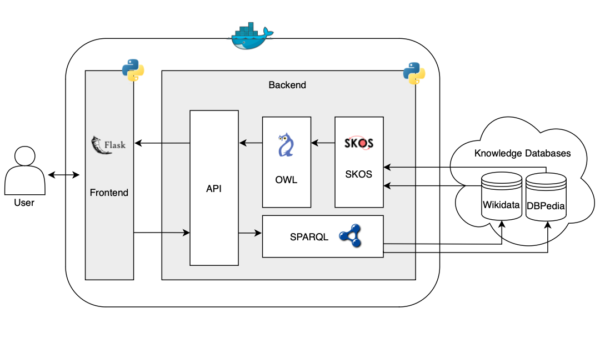

# Wordify - WSDL Project - Checkpoint 3 - Final Report

## Topics

- [Context](#context)
- [Motivation](#motivation)
- [Requirements](#requirements)
- [Existing solutions and approaches](#requirements)
    - [DBpedia Spotlight](#dbpedia-spotlight)
    - [Wikidata Query Service](#wikidata-query-service)
    - [YAGO](#yago)
- [Knowledge Sources](#knowledge-sources)
- [Architecture](#architecture)
- [Challenges](#challenges)
- [Limitations](#limitations)
- [Results evaluation](#results-evaluation)

## Context

Wordify is a system that disambiguates existing entities, possibly in different languages, using Web Semantics and Linked Data principles, concepts, and technologies. It will help a computer and humans to perceive which entity is being referred to, if it is ambiguous in a certain context, or to consult false friends between languages.

## Motivation

Humans always tried to communicate in a clear and simple way with others, as well as with computers. However, it is a critical, inherent problem of the languages used by humans to communicate, is that there are ambiguous.

It is easy to think of a word, or something that can have different meanings, for different contexts: for instance, when someone is talking about a "balance", this word can mean the state in which opposing forces, or can also mean the object used to measure weights. So, when a person is looking on the web the meaning or a representation of the entity "balance", what content should appear?

Another problem faced with natural languages is the fact that the same word can also have divergent meanings in different languages (false friends): the word “citrine,” in some contexts, can refer to a yellow gemstone or a yellowish color. Similarly, the word “tuna” in English refers to a group of fishes, while in Portuguese, it refers to a musical academic group. As a consequence, it becomes difficult to connect the same word to distinct entities, especially when used in different domains.

With the exposure of this problems, it is clear that if it was a system that manipulates a knowledge base in a way that could clarify the entities search, according to the multilanguages charactheristics and contexts. To fulfill this purpose, Wordify will be built.

## Requirements

Globally, the system should be capable of:

- Linking various concepts to the entities being searched;
- Linking various definitions to their corresponding concepts, as well as to the respective languages, if applicable;
- Disambiguating concepts within and across languages;
- Consulting false friends of the entity, if they exist.

While adhering to the Linked Data Principles / Tim Berners-Lee’s 4 Principles:

1. Use Uniform Resource Identifiers (URIs) to identify resources;
2. Use HTTP URIs so people can look up data;
3. Provide useful information in standard formats (RDF);
4. Include links to other URIs to connect data.

## Existing solutions and approaches

### DBpedia Spotlight

DBpedia Spotlight is an entity disambiguation tool that uses the DBpedia knowledge base to identify and link entities in text. It applies natural language processing (NLP) techniques to connect terms to URIs in DBpedia.

### Wikidata Query Service

The Wikidata Query Service provides an interface for SPARQL queries, allowing the retrieval of structured data about entities in Wikidata, facilitating data integration and disambiguation across different resources and languages.

### YAGO

YAGO is a semantic knowledge base that organizes knowledge in an RDF ontology and provides links to various sources, such as DBpedia and Wikidata. It is used for entity disambiguation and building semantic relationships across multiple contexts.

## Knowledge Sources

Wordify would be sustained by the following knowledge databases:

- `Wikidata`, as it is a vast and comprehensive general-purpose knowledge database;
- `DBpedia`, to obtain multilingual linked data from Wikipedia.

`BabelNet` was not used as it did not prove to provide significant additional value compared to the previous two databases in initial experiments.

## Architecture

The proposed architecture for the development of Wordify is as follows:

This way, it is possible to meet all system requirements while adhering to the 4 Linked Data Principles:

- Deployed in `docker` for portability reasons;
- `Web application` to easily present data and queries to the end user;
- Querying resources or entities in DBpedia and Wikidata using `SPARQL`;
- Use of `SKOS` (Simple Knowledge Organization System) to organize concepts, labels, and relationships between concepts. It will be used to catalog synonyms and concept hierarchies when a term is ambiguous, to simplify the merge between different data sources;
- Use of `OWL` (Web Ontology Language) to differentiate various interpretations of a word, resolve ambiguities and present False Friends entities.

The proposed architecture for Wordify's development is illustrated in Figure \ref{fig:architecture}. To meet the system requirements, the application leverages a Docker \cite{docker} deployment for portability, a web interface to facilitate end-user interaction with data, and SPARQL for querying resources in DBpedia and Wikidata. It employs Simple Knowledge Organization System (SKOS) \cite{skos} to organize concepts, catalog synonyms, and manage hierarchies for ambiguous terms, enabling seamless integration of different data sources. Additionally, Web Ontology Language (OWL) \cite{owl} is used to differentiate word interpretations, resolve ambiguities, and identify false friends across entities.

---

Dada um palavra de input do utilizador numa linguagem específica, o sistema faz queries em SPARQL às knowledge databases selecionadas de modo a obter as possíveis entidades associadas, e para cada entidade, o seu significado nas linguagens disponíveis. Os resultados, vindos em formato RDF, são depois usados para a construção de um grafo, também ele suportando RDF, que serve de suporte a queries mais estruturadas que vão ao encontro das necessidades e requisitos de Wordify. A estrutura do grafo resultante está explicitada na Figura X.

O grafo tem o seu root no próprio input do utilizador, catalogado usando SKOS como o principal conceito. Depois, para cada entidade que encontrar, associa-a usando o predicado `SKOS.related` ao input do utilizador. Posteriormente, para cada uma dessas entidades, associa todas as definições que encontrar, e para cada definição a linguagem associada. São usados os predicados `SKOS.lang` e `SKOS.definition`. No final também associa a knowledge database consultada para encontrar essa entidade, usando `OWL.source`. Caso se justifique, também foram aplicados os predicados `OWL.FalseFriend` e `OWL.Ambiguity` entre entidades.

Assim, tanto SKOS como OWL serviram para linkar diferentes elementos, de diferentes fontes, de forma meanibgull. A transformação dos dados para estarem contempados neste grafo segue uma proposta de redução ao máximo dos dados duplicados.

---

ambiguidades

A partir do grafo criado e explicitado na secção anterior, é possível facilmente obter pares de entidades para o mesmo input onde ocorrem ambiguidades. Uma ambiguidade ocorre entre duas entidades, como expresso na Figura XI, quando existe uma linguagem no sistema que retorne significados diferente para o mesmo input.

---

False Friends

Dada a natureza a estrutura do grafo interno de Wordify, pesquisar por pares de entidades que sejam false friends é também simples. False Friends ocorrem quando são encontradas entidades de conotação diferente entre duas linguagens diferentes. Um exemplo siginificativo é ilustrado na Figura XII.

---

Top Languages

A apresentação dos top five languages em percentagem em Wordify é garantida com uma simples query às leafs / línguas considerando todas as entidades do sistema resultantes do input do utilizador e posterior computação matemática, tal como observado na Figura XIII. Esta feature permite que o sistema tente adivinhar, sob o ponto de vista apenas dos dados retornados pelas knowledge sources, a língua em que esse input pode ter sido escrito. Por outras palavras, dado um texto que contenha essa palavra input do utilizador, o sistema consegue computar a provável língua desse texto.

## Challenges

- Vast number of potential entities that could be ambiguous, within and across different languages;
- There are instances where a word may exist in one language but cannot be automatically associated with another representation in another entity in a different language. For instance, "saudade" means missing someone in portuguese, but there is no direct english translation;

## Limitations

- falar da dificuldade em encontrar definições para linguagens específicas;
- quando estamos a cruzar dados entre a dbpedia/wikidata, torna-se impossível saber se há sobreposição; de entidades retornadas (têm URIs diferentes e nada garante que tenham a mesma definição para uma determinada linguagem para podermos desempatar/eliminar duplicados);
- falar dos regionalismos, que se tornam impossíveis dado que não temos:
    - localização;
    - os regionalismos eram mais interessantes em PT, mas existe um lack de informação nas DBs a esse nível;

## Results evaluation

TODO (How ?)

## Group Members

- Fábio Araújo de Sá (up202007658@up.pt)
- Marcos Rafael Peixoto Aires (up202006888@up.pt)
- Pedro Pereira Ferreira (up202004986@up.pt)